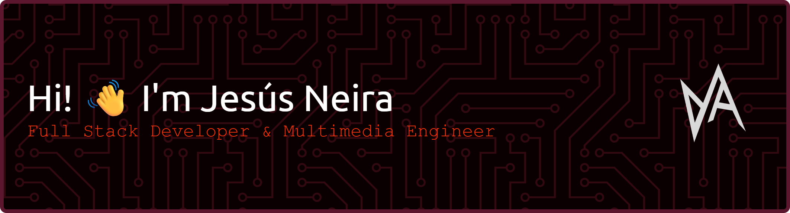

# 💻 Tech Stack

### 🌐 Languages
  
  
  
  

### 📚 Frameworks & Libraries
  
  
  
  
  
  

### 🛠 Tools & Platforms
  
  
  
  
  
  
  

---
  
## 🌐 Portafolio

---

## 📊 GitHub Stats
 
 

## 🏆 GitHub Trophies

### ✍️ Random Dev Quote

---

